# Roommater – Entity Relationship Diagram

## Mermaid ER Diagram

> **Tip:** Paste this into any Mermaid-compatible renderer (GitHub markdown, [mermaid.live](https://mermaid.live), VS Code Mermaid extension) to view the visual diagram.

```mermaid
erDiagram

    %% ===== ENTITIES =====

    users {
        BIGINT id PK
        VARCHAR uid UK "Firebase/external auth UID"
        VARCHAR email UK
        VARCHAR password_hash "nullable"
        VARCHAR google_uid "nullable"
        VARCHAR display_name "nullable"
        VARCHAR photo_url "nullable"
        BIGINT household_id FK "nullable"
        DATETIME joined_household_at "nullable"
        DATETIME created_at
        DATETIME updated_at
    }

    profiles {
        BIGINT id PK
        BIGINT user_id FK, UK
        TEXT bio "nullable"
        TINYINT age "nullable"
        VARCHAR occupation "nullable"
        VARCHAR location "nullable"
        DATETIME created_at
        DATETIME updated_at
    }

    households {
        BIGINT id PK
        VARCHAR name UK
        BIGINT admin_user_id FK
        TINYINT max_members "default 8"
        DATETIME created_at
        DATETIME updated_at
    }

    join_requests {
        BIGINT id PK
        BIGINT requesting_user_id FK
        BIGINT household_id FK
        ENUM status "pending/accepted/rejected"
        DATETIME requested_at
        DATETIME responded_at "nullable"
    }

    tasks {
        BIGINT id PK
        BIGINT household_id FK
        VARCHAR title
        TEXT description "nullable"
        DATETIME due_date
        ENUM recurrence "none/daily/weekly/custom"
        VARCHAR recurrence_days "nullable"
        ENUM status "active/completed/overdue"
        BIGINT created_by FK
        DATETIME completed_at "nullable"
        DATETIME created_at
        DATETIME updated_at
    }

    task_assignments {
        BIGINT id PK
        BIGINT task_id FK
        BIGINT user_id FK
        BOOLEAN completed "default false"
        DATETIME completed_at "nullable"
    }

    streaks {
        BIGINT id PK
        BIGINT user_id FK, UK
        INT current_streak "default 0"
        INT longest_streak "default 0"
        DATE last_completed_date "nullable"
    }

    grocery_items {
        BIGINT id PK
        BIGINT household_id FK
        VARCHAR item_name
        VARCHAR quantity "nullable"
        ENUM status "active/bought"
        BIGINT added_by FK
        BIGINT bought_by FK "nullable"
        DATETIME bought_at "nullable"
        DATETIME created_at
    }

    expenses {
        BIGINT id PK
        BIGINT household_id FK
        VARCHAR title
        DECIMAL amount
        VARCHAR category "nullable"
        BIGINT payer_id FK
        DATETIME created_at
    }

    expense_splits {
        BIGINT id PK
        BIGINT expense_id FK
        BIGINT user_id FK
        DECIMAL share_amount
        BOOLEAN is_settled "default false"
        DATETIME settled_at "nullable"
        BOOLEAN confirmed_by_payer "default false"
    }

    events {
        BIGINT id PK
        BIGINT household_id FK
        VARCHAR title
        TEXT description "nullable"
        DATE event_date
        TIME event_time "nullable"
        VARCHAR location "nullable"
        ENUM event_type "meeting/dinner/party/quiet_hours/other"
        BIGINT created_by FK
        DATETIME created_at
        DATETIME updated_at
    }

    rsvps {
        BIGINT id PK
        BIGINT event_id FK
        BIGINT user_id FK
        ENUM response "yes/no/maybe"
        DATETIME responded_at
    }

    listings {
        BIGINT id PK
        BIGINT owner_id FK
        VARCHAR title
        TEXT description
        DECIMAL rent
        VARCHAR location
        BOOLEAN is_available "default true"
        DATETIME posted_at
        DATETIME updated_at
    }

    listing_images {
        BIGINT id PK
        BIGINT listing_id FK
        VARCHAR image_url
        TINYINT sort_order "default 0"
    }

    chats {
        BIGINT id PK
        TEXT last_message "nullable"
        DATETIME last_message_at "nullable"
        DATETIME created_at
    }

    chat_participants {
        BIGINT id PK
        BIGINT chat_id FK
        BIGINT user_id FK
    }

    messages {
        BIGINT id PK
        BIGINT chat_id FK
        BIGINT sender_id FK
        TEXT text
        DATETIME sent_at
    }

    notifications {
        BIGINT id PK
        BIGINT recipient_user_id FK
        BIGINT household_id FK "nullable"
        ENUM type "task_assigned/event_created/..."
        VARCHAR title
        TEXT body "nullable"
        BOOLEAN is_read "default false"
        BIGINT reference_id "nullable"
        VARCHAR reference_type "nullable"
        DATETIME created_at
    }

    user_settings {
        BIGINT id PK
        BIGINT user_id FK, UK
        BOOLEAN is_dark_mode "default false"
        BOOLEAN notifications_enabled "default true"
        VARCHAR locale "default en"
        DATETIME updated_at
    }

    %% ===== RELATIONSHIPS =====

    users ||--o| profiles : "has"
    users ||--o| streaks : "has"
    users ||--o| user_settings : "has"
    users }o--o| households : "belongs to"

    households ||--|| users : "admin is"
    households ||--o{ join_requests : "receives"
    households ||--o{ tasks : "contains"
    households ||--o{ grocery_items : "contains"
    households ||--o{ expenses : "contains"
    households ||--o{ events : "contains"
    households ||--o{ notifications : "triggers"

    users ||--o{ join_requests : "submits"
    users ||--o{ tasks : "creates"
    users ||--o{ task_assignments : "is assigned"
    users ||--o{ grocery_items : "adds"
    users ||--o{ grocery_items : "buys"
    users ||--o{ expenses : "pays"
    users ||--o{ expense_splits : "owes"
    users ||--o{ events : "creates"
    users ||--o{ rsvps : "responds"
    users ||--o{ listings : "owns"
    users ||--o{ chat_participants : "participates in"
    users ||--o{ messages : "sends"
    users ||--o{ notifications : "receives"

    tasks ||--o{ task_assignments : "assigned via"
    expenses ||--o{ expense_splits : "split into"
    events ||--o{ rsvps : "has"
    listings ||--o{ listing_images : "has"
    chats ||--o{ chat_participants : "has"
    chats ||--o{ messages : "contains"
```

---

## Text-Based Relationship Summary

| # | Parent Table | Relationship | Child Table | FK Column | On Delete |
|---|---|---|---|---|---|
| 1 | `users` | 1 → 0..1 | `profiles` | `profiles.user_id` | CASCADE |
| 2 | `users` | 1 → 0..1 | `streaks` | `streaks.user_id` | CASCADE |
| 3 | `users` | 1 → 0..1 | `user_settings` | `user_settings.user_id` | CASCADE |
| 4 | `households` | 1 → 0..N | `users` | `users.household_id` | SET NULL |
| 5 | `users` | 1 → 1 | `households` | `households.admin_user_id` | RESTRICT |
| 6 | `users` | 1 → 0..N | `join_requests` | `join_requests.requesting_user_id` | CASCADE |
| 7 | `households` | 1 → 0..N | `join_requests` | `join_requests.household_id` | CASCADE |
| 8 | `households` | 1 → 0..N | `tasks` | `tasks.household_id` | CASCADE |
| 9 | `users` | 1 → 0..N | `tasks` | `tasks.created_by` | CASCADE |
| 10 | `tasks` | 1 → 0..N | `task_assignments` | `task_assignments.task_id` | CASCADE |
| 11 | `users` | 1 → 0..N | `task_assignments` | `task_assignments.user_id` | CASCADE |
| 12 | `households` | 1 → 0..N | `grocery_items` | `grocery_items.household_id` | CASCADE |
| 13 | `users` | 1 → 0..N | `grocery_items` | `grocery_items.added_by` | CASCADE |
| 14 | `users` | 1 → 0..N | `grocery_items` | `grocery_items.bought_by` | SET NULL |
| 15 | `households` | 1 → 0..N | `expenses` | `expenses.household_id` | CASCADE |
| 16 | `users` | 1 → 0..N | `expenses` | `expenses.payer_id` | CASCADE |
| 17 | `expenses` | 1 → 0..N | `expense_splits` | `expense_splits.expense_id` | CASCADE |
| 18 | `users` | 1 → 0..N | `expense_splits` | `expense_splits.user_id` | CASCADE |
| 19 | `households` | 1 → 0..N | `events` | `events.household_id` | CASCADE |
| 20 | `users` | 1 → 0..N | `events` | `events.created_by` | CASCADE |
| 21 | `events` | 1 → 0..N | `rsvps` | `rsvps.event_id` | CASCADE |
| 22 | `users` | 1 → 0..N | `rsvps` | `rsvps.user_id` | CASCADE |
| 23 | `users` | 1 → 0..N | `listings` | `listings.owner_id` | CASCADE |
| 24 | `listings` | 1 → 0..N | `listing_images` | `listing_images.listing_id` | CASCADE |
| 25 | `chats` | 1 → 0..N | `chat_participants` | `chat_participants.chat_id` | CASCADE |
| 26 | `users` | 1 → 0..N | `chat_participants` | `chat_participants.user_id` | CASCADE |
| 27 | `chats` | 1 → 0..N | `messages` | `messages.chat_id` | CASCADE |
| 28 | `users` | 1 → 0..N | `messages` | `messages.sender_id` | CASCADE |
| 29 | `users` | 1 → 0..N | `notifications` | `notifications.recipient_user_id` | CASCADE |
| 30 | `households` | 1 → 0..N | `notifications` | `notifications.household_id` | SET NULL |

---

## Table Count: 19

| # | Table | Purpose |
|---|---|---|
| 1 | `users` | Core user identity & authentication |
| 2 | `profiles` | Extended user profile (bio, age, occupation, location) |
| 3 | `households` | Roommate groups (max 8 members) |
| 4 | `join_requests` | Requests to join a household |
| 5 | `tasks` | Household chores with recurrence |
| 6 | `task_assignments` | Many-to-many: tasks ↔ users |
| 7 | `streaks` | Per-user task completion streaks |
| 8 | `grocery_items` | Shared grocery/supply list |
| 9 | `expenses` | Household expense records |
| 10 | `expense_splits` | Per-member share of each expense |
| 11 | `events` | Household calendar events |
| 12 | `rsvps` | Event RSVP responses |
| 13 | `listings` | Roommate/room-for-rent listings |
| 14 | `listing_images` | Images for listings (1-to-many) |
| 15 | `chats` | Chat conversations |
| 16 | `chat_participants` | Many-to-many: chats ↔ users |
| 17 | `messages` | Chat messages |
| 18 | `notifications` | In-app notifications |
| 19 | `user_settings` | Per-user app preferences |
